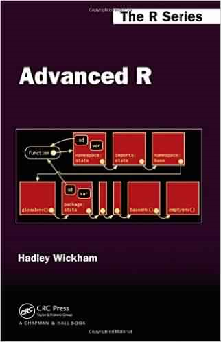
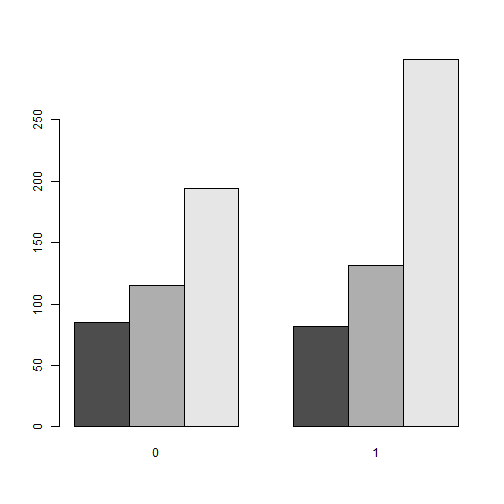

The apply function family in R
========================================================
author: Martin Junge
date: 21-02-12
width: 1920
height: 1080


Overview
========================================================

- functional programming in R
- the apply family
  - apply
  - lapply
  - sapply
  - vapply
  - mapply
- Some exercises

Sources
========================================================



Wickham, H. (2015). Advanced R. Boca Raton, FL: CRC Press.

Functional programming in R
========================================================

- R as a *functional* and object-oriented programming language

"Everything that exists is an object.
Everything that happens is a function call."
— John Chambers


```r
`+`
```

```
function (e1, e2)  .Primitive("+")
```

```r
1 + 2
```

```
[1] 3
```

```r
`+`(1, 2)
```

```
[1] 3
```

apply instead of for-loops
========================================================

- apply functions make use of the nature of R as a functional language
- replace for-loops


```r
head(mtcars)
```

```
                   mpg cyl disp  hp drat    wt  qsec vs am gear carb
Mazda RX4         21.0   6  160 110 3.90 2.620 16.46  0  1    4    4
Mazda RX4 Wag     21.0   6  160 110 3.90 2.875 17.02  0  1    4    4
Datsun 710        22.8   4  108  93 3.85 2.320 18.61  1  1    4    1
Hornet 4 Drive    21.4   6  258 110 3.08 3.215 19.44  1  0    3    1
Hornet Sportabout 18.7   8  360 175 3.15 3.440 17.02  0  0    3    2
Valiant           18.1   6  225 105 2.76 3.460 20.22  1  0    3    1
```

```r
colmeans <- NULL
for (i in 1:ncol(mtcars))
{
  m <- mean(mtcars[, i])
  colmeans <- c(colmeans, m)
}
names(colmeans) <- names(mtcars)
colmeans
```

```
       mpg        cyl       disp         hp       drat         wt       qsec 
 20.090625   6.187500 230.721875 146.687500   3.596563   3.217250  17.848750 
        vs         am       gear       carb 
  0.437500   0.406250   3.687500   2.812500 
```


apply /1
========================================================

- most basic variant: `apply`


```r
head(mtcars)
```

```
                   mpg cyl disp  hp drat    wt  qsec vs am gear carb
Mazda RX4         21.0   6  160 110 3.90 2.620 16.46  0  1    4    4
Mazda RX4 Wag     21.0   6  160 110 3.90 2.875 17.02  0  1    4    4
Datsun 710        22.8   4  108  93 3.85 2.320 18.61  1  1    4    1
Hornet 4 Drive    21.4   6  258 110 3.08 3.215 19.44  1  0    3    1
Hornet Sportabout 18.7   8  360 175 3.15 3.440 17.02  0  0    3    2
Valiant           18.1   6  225 105 2.76 3.460 20.22  1  0    3    1
```

```r
apply(mtcars, MARGIN = 2, FUN = mean)
```

```
       mpg        cyl       disp         hp       drat         wt       qsec 
 20.090625   6.187500 230.721875 146.687500   3.596563   3.217250  17.848750 
        vs         am       gear       carb 
  0.437500   0.406250   3.687500   2.812500 
```

apply /2
========================================================


```r
apply(mtcars, MARGIN = 1, FUN = mean)
```

```
          Mazda RX4       Mazda RX4 Wag          Datsun 710      Hornet 4 Drive 
           29.90727            29.98136            23.59818            38.73955 
  Hornet Sportabout             Valiant          Duster 360           Merc 240D 
           53.66455            35.04909            59.72000            24.63455 
           Merc 230            Merc 280           Merc 280C          Merc 450SE 
           27.23364            31.86000            31.78727            46.43091 
         Merc 450SL         Merc 450SLC  Cadillac Fleetwood Lincoln Continental 
           46.50000            46.35000            66.23273            66.05855 
  Chrysler Imperial            Fiat 128         Honda Civic      Toyota Corolla 
           65.97227            19.44091            17.74227            18.81409 
      Toyota Corona    Dodge Challenger         AMC Javelin          Camaro Z28 
           24.88864            47.24091            46.00773            58.75273 
   Pontiac Firebird           Fiat X1-9       Porsche 914-2        Lotus Europa 
           57.37955            18.92864            24.77909            24.88027 
     Ford Pantera L        Ferrari Dino       Maserati Bora          Volvo 142E 
           60.97182            34.50818            63.15545            26.26273 
```

- Cave: not a meaningful statistic!

apply /3
========================================================


```r
head(iris)
```

```
  Sepal.Length Sepal.Width Petal.Length Petal.Width Species
1          5.1         3.5          1.4         0.2  setosa
2          4.9         3.0          1.4         0.2  setosa
3          4.7         3.2          1.3         0.2  setosa
4          4.6         3.1          1.5         0.2  setosa
5          5.0         3.6          1.4         0.2  setosa
6          5.4         3.9          1.7         0.4  setosa
```

```r
iris$max_length <- apply(iris[c("Sepal.Length", "Petal.Length")], 1, max)
head(iris)
```

```
  Sepal.Length Sepal.Width Petal.Length Petal.Width Species max_length
1          5.1         3.5          1.4         0.2  setosa        5.1
2          4.9         3.0          1.4         0.2  setosa        4.9
3          4.7         3.2          1.3         0.2  setosa        4.7
4          4.6         3.1          1.5         0.2  setosa        4.6
5          5.0         3.6          1.4         0.2  setosa        5.0
6          5.4         3.9          1.7         0.4  setosa        5.4
```

apply /4
========================================================


```r
check_four <- function(x)
{
  check <- any(x > 4)
  return(check)
}
iris$check <- apply(iris[1:4], 1, check_four)
head(iris)
```

```
  Sepal.Length Sepal.Width Petal.Length Petal.Width Species max_length check
1          5.1         3.5          1.4         0.2  setosa        5.1  TRUE
2          4.9         3.0          1.4         0.2  setosa        4.9  TRUE
3          4.7         3.2          1.3         0.2  setosa        4.7  TRUE
4          4.6         3.1          1.5         0.2  setosa        4.6  TRUE
5          5.0         3.6          1.4         0.2  setosa        5.0  TRUE
6          5.4         3.9          1.7         0.4  setosa        5.4  TRUE
```

apply /5
========================================================


```r
iris$check <- apply(iris[1:4], 1, function(x) any(x > 4))
head(iris)
```

```
  Sepal.Length Sepal.Width Petal.Length Petal.Width Species max_length check
1          5.1         3.5          1.4         0.2  setosa        5.1  TRUE
2          4.9         3.0          1.4         0.2  setosa        4.9  TRUE
3          4.7         3.2          1.3         0.2  setosa        4.7  TRUE
4          4.6         3.1          1.5         0.2  setosa        4.6  TRUE
5          5.0         3.6          1.4         0.2  setosa        5.0  TRUE
6          5.4         3.9          1.7         0.4  setosa        5.4  TRUE
```

tapply /1
========================================================

- applies a function on a vector group-wise


```r
Hmisc::describe(mtcars$cyl)
```

```
mtcars$cyl 
       n  missing distinct     Info     Mean      Gmd 
      32        0        3    0.866    6.188    1.948 
                            
Value          4     6     8
Frequency     11     7    14
Proportion 0.344 0.219 0.438
```

```r
tapply(mtcars$hp, mtcars$cyl, mean)
```

```
        4         6         8 
 82.63636 122.28571 209.21429 
```

```r
tapply(mtcars$hp, mtcars$cyl, max)
```

```
  4   6   8 
113 175 335 
```

tapply /2
========================================================


```r
means_cyl_am <- tapply(mtcars$hp, list(mtcars$cyl, mtcars$am), mean)
barplot(means_cyl_am, beside = TRUE)
```



tapply /3
========================================================


```r
check_mpg <- function(x)
{
  check <- any(x > 20)
  return(check)
}

tapply(mtcars$mpg, list(cyl = mtcars$cyl, am = mtcars$am), check_mpg)
```

```
   am
cyl     0     1
  4  TRUE  TRUE
  6  TRUE  TRUE
  8 FALSE FALSE
```

```r
tapply(mtcars$mpg, list(cyl = mtcars$cyl, am = mtcars$am), function(x) any(x > 20))
```

```
   am
cyl     0     1
  4  TRUE  TRUE
  6  TRUE  TRUE
  8 FALSE FALSE
```

lapply
========================================================

- Input is a list, output is a list (`lapply`) or vector (`sapply`)


```r
mtcars_list <- list(gear = mtcars$gear[1:4], am = mtcars$am[1:3])
mtcars_list
```

```
$gear
[1] 4 4 4 3

$am
[1] 1 1 1
```

```r
lapply(mtcars_list, mean)
```

```
$gear
[1] 3.75

$am
[1] 1
```

sapply
========================================================


```r
mtcars_list <- list(gear = mtcars$gear[1:4], am = mtcars$am[1:3])
mtcars_list
```

```
$gear
[1] 4 4 4 3

$am
[1] 1 1 1
```

```r
sapply(mtcars_list, mean)
```

```
gear   am 
3.75 1.00 
```

```r
sapply(mtcars_list, mean, simplify = FALSE)
```

```
$gear
[1] 3.75

$am
[1] 1
```

vapply
========================================================


```r
mtcars_list <- list(gear = mtcars$gear[1:4], am = mtcars$am[1:3])
mtcars_list
```

```
$gear
[1] 4 4 4 3

$am
[1] 1 1 1
```

```r
vapply(mtcars_list, mean, numeric(1))
```

```
gear   am 
3.75 1.00 
```

```r
# vapply(mtcars_list, mean, integer(1)) does produce error
```

lapply and data frames /1
========================================================

Since data.frames are essentially lists, `lapply` is very useful in the functional programming with data.frames


```r
str(mtcars)
```

```
'data.frame':	32 obs. of  11 variables:
 $ mpg : num  21 21 22.8 21.4 18.7 18.1 14.3 24.4 22.8 19.2 ...
 $ cyl : num  6 6 4 6 8 6 8 4 4 6 ...
 $ disp: num  160 160 108 258 360 ...
 $ hp  : num  110 110 93 110 175 105 245 62 95 123 ...
 $ drat: num  3.9 3.9 3.85 3.08 3.15 2.76 3.21 3.69 3.92 3.92 ...
 $ wt  : num  2.62 2.88 2.32 3.21 3.44 ...
 $ qsec: num  16.5 17 18.6 19.4 17 ...
 $ vs  : num  0 0 1 1 0 1 0 1 1 1 ...
 $ am  : num  1 1 1 0 0 0 0 0 0 0 ...
 $ gear: num  4 4 4 3 3 3 3 4 4 4 ...
 $ carb: num  4 4 1 1 2 1 4 2 2 4 ...
```

lapply and data frames /2
========================================================


```r
mtcars[c("cyl", "am", "gear")] <- lapply(mtcars[c("cyl", "am", "gear")], as.factor)
str(mtcars)
```

```
'data.frame':	32 obs. of  11 variables:
 $ mpg : num  21 21 22.8 21.4 18.7 18.1 14.3 24.4 22.8 19.2 ...
 $ cyl : Factor w/ 3 levels "4","6","8": 2 2 1 2 3 2 3 1 1 2 ...
 $ disp: num  160 160 108 258 360 ...
 $ hp  : num  110 110 93 110 175 105 245 62 95 123 ...
 $ drat: num  3.9 3.9 3.85 3.08 3.15 2.76 3.21 3.69 3.92 3.92 ...
 $ wt  : num  2.62 2.88 2.32 3.21 3.44 ...
 $ qsec: num  16.5 17 18.6 19.4 17 ...
 $ vs  : num  0 0 1 1 0 1 0 1 1 1 ...
 $ am  : Factor w/ 2 levels "0","1": 2 2 2 1 1 1 1 1 1 1 ...
 $ gear: Factor w/ 3 levels "3","4","5": 2 2 2 1 1 1 1 2 2 2 ...
 $ carb: num  4 4 1 1 2 1 4 2 2 4 ...
```

lapply and data frames /3
========================================================


```r
is_numeric <- sapply(mtcars, is.numeric)
is_numeric
```

```
  mpg   cyl  disp    hp  drat    wt  qsec    vs    am  gear  carb 
 TRUE FALSE  TRUE  TRUE  TRUE  TRUE  TRUE  TRUE FALSE FALSE  TRUE 
```

```r
has_outliers <- sapply(mtcars[is_numeric], function(x) length(boxplot(x, plot = FALSE)$out) > 0)
has_outliers
```

```
  mpg  disp    hp  drat    wt  qsec    vs  carb 
FALSE FALSE  TRUE FALSE  TRUE  TRUE FALSE  TRUE 
```

lapply and data frames /4
========================================================


```r
mtcars[is_numeric][has_outliers] <- lapply(mtcars[is_numeric][has_outliers], log)
head(mtcars)
```

```
                   mpg cyl disp       hp drat        wt     qsec vs am gear
Mazda RX4         21.0   6  160 4.700480 3.90 0.9631743 2.800933  0  1    4
Mazda RX4 Wag     21.0   6  160 4.700480 3.90 1.0560527 2.834389  0  1    4
Datsun 710        22.8   4  108 4.532599 3.85 0.8415672 2.923699  1  1    4
Hornet 4 Drive    21.4   6  258 4.700480 3.08 1.1678274 2.967333  1  0    3
Hornet Sportabout 18.7   8  360 5.164786 3.15 1.2354715 2.834389  0  0    3
Valiant           18.1   6  225 4.653960 2.76 1.2412686 3.006672  1  0    3
                       carb
Mazda RX4         1.3862944
Mazda RX4 Wag     1.3862944
Datsun 710        0.0000000
Hornet 4 Drive    0.0000000
Hornet Sportabout 0.6931472
Valiant           0.0000000
```

lapply and more complex functions /1
========================================================


```r
library(gapminder)
head(gapminder)
```

```
# A tibble: 6 x 6
  country     continent  year lifeExp      pop gdpPercap
  <fct>       <fct>     <int>   <dbl>    <int>     <dbl>
1 Afghanistan Asia       1952    28.8  8425333      779.
2 Afghanistan Asia       1957    30.3  9240934      821.
3 Afghanistan Asia       1962    32.0 10267083      853.
4 Afghanistan Asia       1967    34.0 11537966      836.
5 Afghanistan Asia       1972    36.1 13079460      740.
6 Afghanistan Asia       1977    38.4 14880372      786.
```

lapply and more complex functions /2
========================================================


```r
cont_split <- split(gapminder, gapminder$continent)
str(cont_split)
```

```
List of 5
 $ Africa  : tibble [624 x 6] (S3: tbl_df/tbl/data.frame)
  ..$ country  : Factor w/ 142 levels "Afghanistan",..: 3 3 3 3 3 3 3 3 3 3 ...
  ..$ continent: Factor w/ 5 levels "Africa","Americas",..: 1 1 1 1 1 1 1 1 1 1 ...
  ..$ year     : int [1:624] 1952 1957 1962 1967 1972 1977 1982 1987 1992 1997 ...
  ..$ lifeExp  : num [1:624] 43.1 45.7 48.3 51.4 54.5 ...
  ..$ pop      : int [1:624] 9279525 10270856 11000948 12760499 14760787 17152804 20033753 23254956 26298373 29072015 ...
  ..$ gdpPercap: num [1:624] 2449 3014 2551 3247 4183 ...
 $ Americas: tibble [300 x 6] (S3: tbl_df/tbl/data.frame)
  ..$ country  : Factor w/ 142 levels "Afghanistan",..: 5 5 5 5 5 5 5 5 5 5 ...
  ..$ continent: Factor w/ 5 levels "Africa","Americas",..: 2 2 2 2 2 2 2 2 2 2 ...
  ..$ year     : int [1:300] 1952 1957 1962 1967 1972 1977 1982 1987 1992 1997 ...
  ..$ lifeExp  : num [1:300] 62.5 64.4 65.1 65.6 67.1 ...
  ..$ pop      : int [1:300] 17876956 19610538 21283783 22934225 24779799 26983828 29341374 31620918 33958947 36203463 ...
  ..$ gdpPercap: num [1:300] 5911 6857 7133 8053 9443 ...
 $ Asia    : tibble [396 x 6] (S3: tbl_df/tbl/data.frame)
  ..$ country  : Factor w/ 142 levels "Afghanistan",..: 1 1 1 1 1 1 1 1 1 1 ...
  ..$ continent: Factor w/ 5 levels "Africa","Americas",..: 3 3 3 3 3 3 3 3 3 3 ...
  ..$ year     : int [1:396] 1952 1957 1962 1967 1972 1977 1982 1987 1992 1997 ...
  ..$ lifeExp  : num [1:396] 28.8 30.3 32 34 36.1 ...
  ..$ pop      : int [1:396] 8425333 9240934 10267083 11537966 13079460 14880372 12881816 13867957 16317921 22227415 ...
  ..$ gdpPercap: num [1:396] 779 821 853 836 740 ...
 $ Europe  : tibble [360 x 6] (S3: tbl_df/tbl/data.frame)
  ..$ country  : Factor w/ 142 levels "Afghanistan",..: 2 2 2 2 2 2 2 2 2 2 ...
  ..$ continent: Factor w/ 5 levels "Africa","Americas",..: 4 4 4 4 4 4 4 4 4 4 ...
  ..$ year     : int [1:360] 1952 1957 1962 1967 1972 1977 1982 1987 1992 1997 ...
  ..$ lifeExp  : num [1:360] 55.2 59.3 64.8 66.2 67.7 ...
  ..$ pop      : int [1:360] 1282697 1476505 1728137 1984060 2263554 2509048 2780097 3075321 3326498 3428038 ...
  ..$ gdpPercap: num [1:360] 1601 1942 2313 2760 3313 ...
 $ Oceania : tibble [24 x 6] (S3: tbl_df/tbl/data.frame)
  ..$ country  : Factor w/ 142 levels "Afghanistan",..: 6 6 6 6 6 6 6 6 6 6 ...
  ..$ continent: Factor w/ 5 levels "Africa","Americas",..: 5 5 5 5 5 5 5 5 5 5 ...
  ..$ year     : int [1:24] 1952 1957 1962 1967 1972 1977 1982 1987 1992 1997 ...
  ..$ lifeExp  : num [1:24] 69.1 70.3 70.9 71.1 71.9 ...
  ..$ pop      : int [1:24] 8691212 9712569 10794968 11872264 13177000 14074100 15184200 16257249 17481977 18565243 ...
  ..$ gdpPercap: num [1:24] 10040 10950 12217 14526 16789 ...
```

lapply and more complex functions /3
========================================================

Fitting a linear regression model with *population* and *GDP per capita* as predictors and *Life Expectancy* as outcome


```r
fit_lin_reg <- function(cont)
{
  mod_lr <- lm(lifeExp ~ pop + gdpPercap, data = cont)
  predicted <- predict(mod_lr, cont)
  r2 <- cor(cont$lifeExp, predicted)^2
  aic <- AIC(mod_lr)
  bic <- BIC(mod_lr)
  n <- dim(cont)[1]

  return(list(R_squared = r2, AIC = aic, BIC = bic, N = n))
}
```

lapply and more complex functions /4
========================================================


```r
lin_reg_res_list <- lapply(cont_split, fit_lin_reg)
lin_reg_res_list[[1]]
```

```
$R_squared
[1] 0.1978661

$AIC
[1] 4403.049

$BIC
[1] 4420.793

$N
[1] 624
```

lapply and more complex functions /5
========================================================


```r
lin_reg_res_tab <- do.call(rbind, lin_reg_res_list)
lin_reg_res_tab
```

```
         R_squared AIC      BIC      N  
Africa   0.1978661 4403.049 4420.793 624
Americas 0.3286239 2079.744 2094.559 300
Asia     0.1530461 3024.073 3039.999 396
Europe   0.6101744 1908.112 1923.656 360
Oceania  0.935343  73.38438 78.0966  24 
```

mapply /1
========================================================

The multivariate member of the apply function family


```r
a <- c(seq(1, 10, 2))
a
```

```
[1] 1 3 5 7 9
```

```r
b <- c(seq(20, 1, -4))
b
```

```
[1] 20 16 12  8  4
```

```r
mapply(`+`, x = a, y = b)
```

```
[1] 21 19 17 15 13
```

```r
a + b
```

```
[1] 21 19 17 15 13
```

mapply /2
========================================================


```r
library(ranger)
fit_grid <- expand.grid(n_trees = c(100, 500), rep = c(TRUE, FALSE))
fit_grid
```

```
  n_trees   rep
1     100  TRUE
2     500  TRUE
3     100 FALSE
4     500 FALSE
```

```r
mod_rf <- mapply(ranger, num.trees = fit_grid$n_trees, replace = fit_grid$rep,
                 MoreArgs = list(formula = as.factor(am) ~ ., data = mtcars), SIMPLIFY = FALSE)
```

mapply /3
========================================================


```r
str(mod_rf, max.level = 1)
```

```
List of 4
 $ :List of 14
  ..- attr(*, "class")= chr "ranger"
 $ :List of 14
  ..- attr(*, "class")= chr "ranger"
 $ :List of 14
  ..- attr(*, "class")= chr "ranger"
 $ :List of 14
  ..- attr(*, "class")= chr "ranger"
```

mapply /4
========================================================


```r
conf_mat_list <- lapply(mod_rf, function(x) x$confusion.matrix)
conf_mat_list
```

```
[[1]]
    predicted
true  0  1
   0 17  2
   1  2 11

[[2]]
    predicted
true  0  1
   0 17  2
   1  1 12

[[3]]
    predicted
true  0  1
   0 18  1
   1  2 11

[[4]]
    predicted
true  0  1
   0 17  2
   1  2 11
```

Some exercises
========================================================

- get the number of missing values by column for the `airquality` dataset
- Do a Fisher z transformation for all columns of `mtcars` with a variance over 100
- apply a logistic regression on `vm` of `mtcars` with predictors `mpg` and `hp` for cars with automatic and non-automatic transmission
  - extract `AIC` and `BIC` from each model and plot it in a grouped barplot

Beyond base R
========================================================

- If you use `tidyverse`, have a look at the `map` and `nest` functions

Thank you very much for your attention!
========================================================

contact: martin.junge@lsp.de

This presentation will be available at https://github.com/mjunge-lsp/statista-apply/blob/master/statista-apply-21-02-12.md

